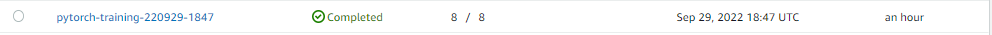

# Image Classification using AWS SageMaker
## This assignment is a part of AWS Machine Learning Engineer Nanodegree Program.

Using AWS Sagemaker to train a pretrained model Resnet50 to perform image classification by using the Sagemaker profiling, debugger, hyperparameter tuning
The following tasks are performed.
- Using a Resnet50 pretrained model from pytorch library(https://pytorch.org/vision/master/generated/torchvision.models.resnet50.html)
- Fine-tune the model with hyperparameter tuning
- Using the Sagemaker profiling, debugger
- Deploy the model and perform inference

## Project Set Up and Installation
Enter AWS through the gateway in the course and open SageMaker Studio. 
Download the starter files.
Download/Make the dataset available. 
You can use this link to get the starter 
## Dataset
Udacity's Dog Breed Classification Data set is used.
The dataset can be downloaded [here](https://s3-us-west-1.amazonaws.com/udacity-aind/dog-project/dogImages.zip).

### Access
Upload the data to an S3 bucket through the AWS Gateway so that SageMaker has access to the data. 

## Files Used

- `train_and_deploy.ipynb` it contains all step to upload data to s3, fine tunning, get best model hyperparameters, train the bestperformance model and test it , and make sagemaker profiling and debugger, and finally deploy the model and make an inference.

- `hpo.py` This is the python script using to train and test all models in tuning hyperparameters step.

- `train.py` This is the python script using to train the best performance model and test it.

- `inference` This script we use it to deploy the model on AWS and make prediction.

## Hyperparameter Tuning
- The Resnet50 used to learn the data because it is trained on a lot of data and it's concolution can get the general feature 
- One fully connected layer is used on top of resnet50 to predict 133 number of dog breed
- Batch- size, Epochs, and Learning rate are used to search for the best model in  the tunning hyperparameters step
     - batch size : [32,64,128,256,512]
     - epochs : (6,8)
     - lr : (0.001,0.1)
 
 
 
 
 

## Debugging and Profiling
### Debugger Output
The Graphical representation of the Cross Entropy Loss.

### Profiler Output
The profiler report can be found [here](profile-output/profiler-report.html).

## Model Deployment
- Model was deployed to a "ml.m5.large" instance type and "endpoint_inference.py" script is used to setup and deploy our working endpoint.
- For testing purposes ,one test images are stored in the "images" folder.
- image are fed to the endpoint for inference.

### Inference Response

### Model Endpoint
